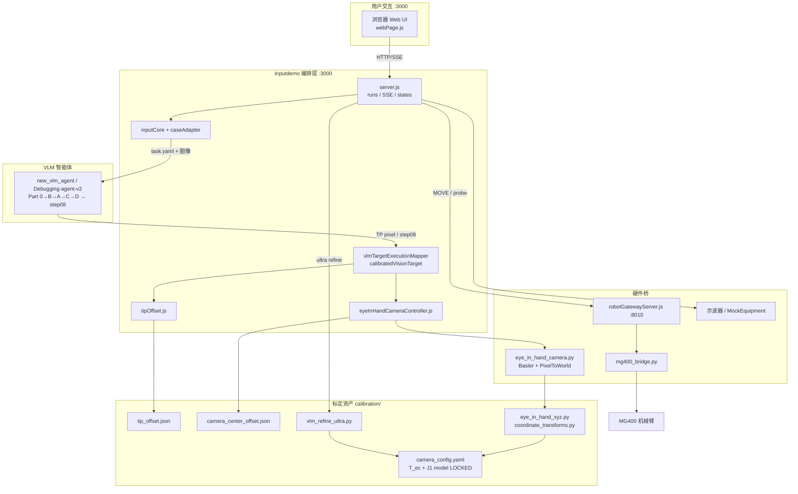
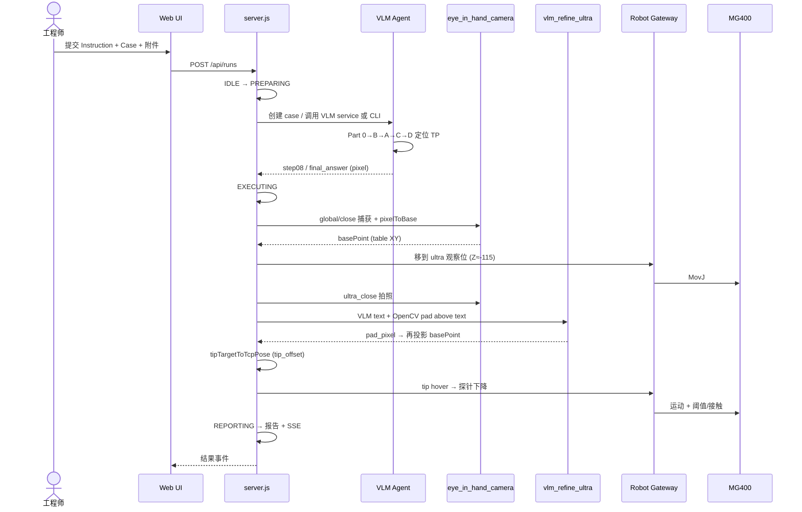
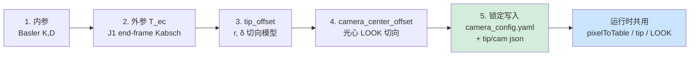
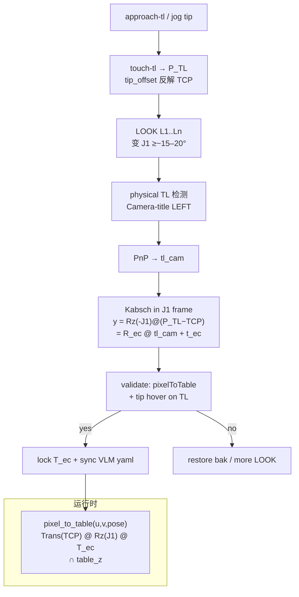
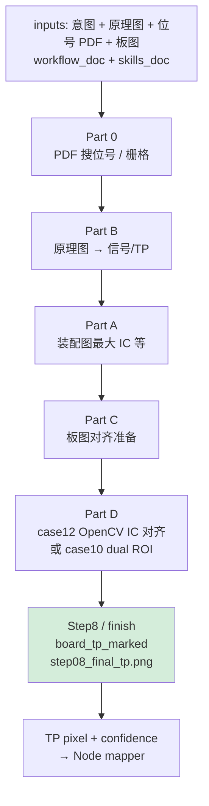
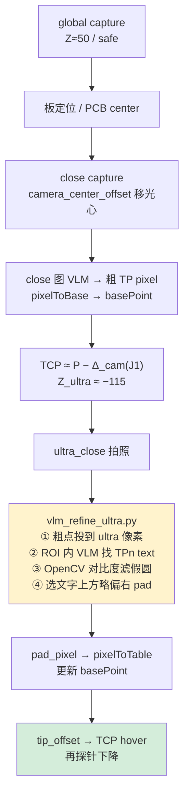
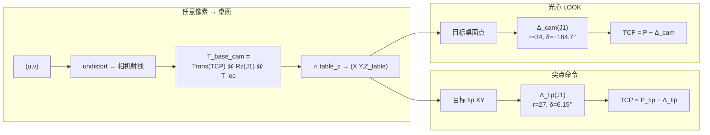
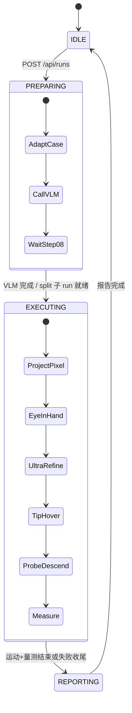
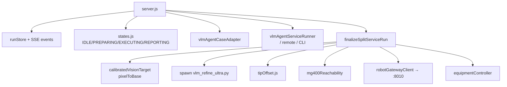

# PCBA Debugging Bench — 架构与 Workflow（2026-08）

> 基于当前仓库真实代码整理：Inputdemo 编排、VLM Agent、J1 眼在手标定、ultra TP 精修、tip_offset。
> 共 **8** 张 Mermaid 图。旧版六月文档见 `真实架构与流程-基于当前代码.md`（部分内容已过时，以本文为准）。

---

## 图 1 — 整仓系统架构



---

## 图 2 — 端到端主 Workflow



---

## 图 3 — ① 标定总流程



| 量 | 模型 | 锁定文件 |
|---|---|---|
| `T_end_to_camera` | `T_base_cam = Trans(TCP) @ Rz(J1) @ T_ec` | `calibration/camera_config.yaml` |
| `tip_offset` | `tip = TCP + r·(sin(J1+δ), −cos(J1+δ))` | `tip_offset.json` |
| `camera_center_offset` | 同形式，独立 r/δ | `camera_center_offset.json` |

三者独立，互不代入。

---

## 图 4 — ①a 外参 / J1 标定细节



主脚本：`calibrate_extrinsics_recal.py` / `calibrate_camera_j1_offset.py`；核心几何：`eye_in_hand_xyz.compose_base_to_camera`。

---

## 图 5 — ② VLM TP 定位流程



规程：`new_vlm_agent/data/skills/STANDARD_WORKFLOW.md` + `SKILL.md`。

---

## 图 6 — ③ 眼在手捕获 + Ultra 精修



关键：`finalizeSplitServiceRun`（`server.js`）+ `calibration/vlm_refine_ultra.py`。

---

## 图 7 — ④ 运行时坐标变换



J1 来源：`pose.j1_deg` 优先，否则 `atan2(TCP_y, TCP_x)`。法兰角 `R`(J4) 不参与相机挂载。

---

## 图 8 — ⑤ Node 状态机与模块调用





---

## 端口与启动（速查）

| 服务 | 命令 | 端口 |
|---|---|---|
| Web + API | `cd Inputdemo && npm start` | 3000 |
| Robot Gateway | `cd Inputdemo && npm run robot-gateway` | 8010 |
| VLM Service | `python -m agent.service`（视部署） | 8000（常见） |

标定验证示例：

```bash
python calibration/_find_tl_z110_now.py -120
python calibration/vlm_refine_ultra.py <ultra.jpg> <x,y,z> <x,y,z,r> TP9
```

---

## 相关代码入口

| 主题 | 路径 |
|---|---|
| 编排 | `Inputdemo/src/api/server.js` |
| J1 几何 | `calibration/eye_in_hand_xyz.py` |
| 像素投影 | `calibration/coordinate_transforms.py` |
| 锁定外参 | `calibration/camera_config.yaml` |
| Ultra pad | `calibration/vlm_refine_ultra.py` |
| Tip | `calibration/tip_offset.py` / `Inputdemo/src/domain/tipOffset.js` |
| VLM 规程 | `new_vlm_agent/data/skills/STANDARD_WORKFLOW.md` |
